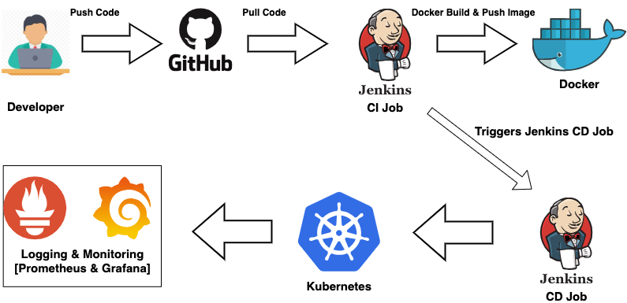

## Step 1: Configure Credentials in Jenkins

- Configure SSH credentials globally for DockerLogin. 
- Configure SSH credentials globally for Jenkins to Monitor Github.
- Configure SSH credentials globally for Remote VM.
- Configure environment variables in `Jenkinsfile`

## Step 2: Clone Source Code

- Clone source code into Jenkins workspace

## Step 3: Build

- Build Docker image using `Dockerfile`
- Tag and push Docker image to Docker Hub

## Step 4: Deployment

- Deploy to remote VM using `deployment.yaml` file
- Run containers inside Kubernetes pods

## Step 5: Testing

- Perform health check using Node IP:

  ```bash
  curl "http://${env.INTERNAL_IP}:${Node_Port}/health"

## Step 6: Monitoring Setup (Prometheus + Grafana)

- Install **Prometheus** and **Grafana** using Helm charts.
  
- Edit Prometheus `ConfigMap` to scrape your Golang app metrics:

     ```bash
    scrape_configs:
        - job_name: "golang-app"
        static_configs:
            - targets:
            - golang-service:8080       
     ```bash
    kubectl edit configmap prometheus-server -n <namespace>

- Create a Grafana admin credentials secret:
    
    ```bash
    kubectl create secret generic grafana-admin-secret \
    --from-literal=admin-user='admin' \
    --from-literal=admin-password='MyStrongP@ssw0rd' \
    -n <namespace>

- Create grafana-values.yaml with the following config:
    
    ```bash
    admin:
        existingSecret: grafana-admin-secret
        userKey: admin-user
        passwordKey: admin-password

- Access Prometheus and Grafana UIs locally via port forwarding:
    
    ```bash
    kubectl port-forward svc/prometheus 9090:80 -n <namespace>
    kubectl port-forward svc/grafana 3000:80 -n <namespace>

## Step 7: Validate the Setup

- Check all Kubernetes resources: 
    
    ```bash 
    kubectl get all -n <namespace>

- Validate your app's health endpoint: 
    ```bash
    curl "http://${INTERNAL_IP}:${NODE_PORT}/health"
- Validate Prometheus : 
    ```bash
    "http://localhost:9090/targets"

- Validate Grafana: 
    ```bash
    "http://localhost:3000"
